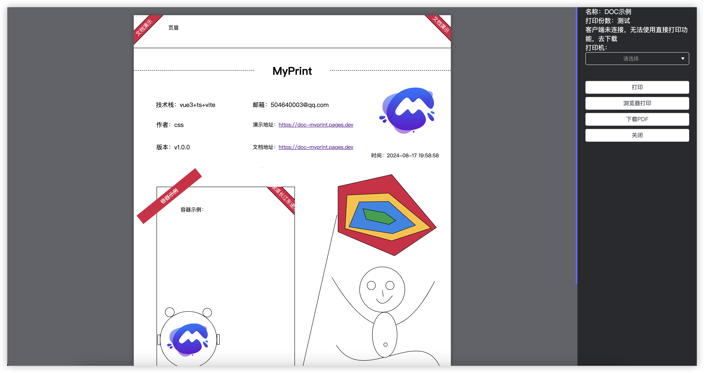

# MyPrint

> 操作简单，组件丰富的一站式打印解决方案打印设计器

| 项目               | 说明                               | 地址(github)                                                | 地址(gitee)                                                |
|:-----------------|----------------------------------|-----------------------------------------------------------|----------------------------------------------------------|
| MyPrint          | 主项目                              | [`前往`](https://github.com/MyPrintDesign/myprint)          | [`前往`](https://gitee.com/MyPrintDesign/myprint)          |
| MyPrint-server   | 服务端[`(去下载)`](https://doc.cfcss.top/guide/deploy/centos)                   | —                                                         | —                                                        |
| MyPrint-desktop  | 客户端[`(去下载)`](https://doc.cfcss.top/guide/deploy/client)                   | —                                                         | —                                                        |
| MyPrint-examples | 客户端                              | [`前往`](https://github.com/MyPrintDesign/myprint-examples) | [`前往`](https://gitee.com/MyPrintDesign/myprint-examples) |
| MyPrint-docker   | docker构建镜像                       | [`前往`](https://github.com/MyPrintDesign/myprint-docker)   | [`前往`](https://gitee.com/MyPrintDesign/myprint-docker)   |
| 文档               | [`前往`](https://doc.cfcss.top)  | —                                                         | —                                                        |
| 体验服(demo)        | [`前往`](https://demo.cfcss.top) | —                                                         | —                                                        |

## 说明

* 项目技术栈：`Vue@3.4.31` `TypeScript@5.0.2` `Vite@5.2.6`
* 打印设计面板，设计结果支持打印、生成pdf、生成图片，支持浏览器、客户端、服务端三种生成，并且三种方式生成结果高度统一。
* 支持`多级表头`数据表格，表格支持`条形码`与`二维码`，以及表格数据统计。
* 支持svg、手画板。
* 操作简单，内置快捷键：Ctrl+c、Ctrl+v快速复制粘贴、Ctrl+s保存、Ctrl+z回滚、Ctrl+y重做、方向键微调位置。
* 多种安装方式支持`centos`、`debian`、`docker`、`k8s` 一键安装

## 更新日志
[查看更新日志](https://github.com/MyPrintDesign/myprint/blob/main/CHANGELOG.md)

## 有图有真相


<table width="100%" align="center">

<tr>
<td align="center">设计</td>
<td align="center">预览</td>
</tr>

<tr>
<td align="center"></td>
<td align="center"></td>
</tr>
<tr>
<td align="center"></td>
<td align="center"></td>
</tr>
<tr>
<td align="center"></td>
<td align="center"></td>
</tr>
<tr>
<td align="center"></td>
<td align="center"></td>
</tr>
<tr>
<td align="center">QQ交流群</td>
<td align="center"></td>
</tr>
</table>

## 如何使用

### npm 安装

```sh [npm]
npm install myprint-design
```

```sh [yarn]
yarn add -D myprint-design
```

### 浏览器直接引入

直接通过浏览器的 HTML 标签导入 MyPrint，然后就可以使用全局变量 MyPrintDesign 了。

```html
<link rel="stylesheet" href="//jsd.onmicrosoft.cn/npm/myprint-design/css/styles/index.css" />
<!-- Import Vue 3 -->
<script src="//jsd.onmicrosoft.cn/npm/vue@3"></script>
<!-- Import component library -->
<script src="//jsd.onmicrosoft.cn/npm/myprint-design"></script>

```

### 在线示例

通过 CDN 的方式我们可以很容易地使用 MyPrint 写出一个 设计 页面。 [在线演示](https://codepen.io/chushenshen/pen/BagYjLo)

### 直接引用(仅支持ts)

> 下载本项目(参考package/demo)

#### 如何引用？

```
.
├─ packages
│  ├─ demo
│  ├─ design
└─ └─ docs

复制design代码 到对应项目目录下

配置 vite.config.ts

#vite.config.ts
export default defineConfig({
    ...
    resolve: {
        alias: {
            'myprint-design': fileURLToPath(new URL('../design/src', import.meta.url))
        }
    }
});
```

## 配套服务

### 客户端（本地调用打印机进行打印）

> 本地客户端支持局域网连接，可以做到同一局域网内别的机器的浏览器提交任务，由同一个打印机进行打印

### 下载客户端

|         | 架构      |                                  地址                                  |
|---------|---------|:--------------------------------------------------------------------:|
| Windows | 64位     |    [下载地址](https://file.cfcss.top/MyPrint-Windows-x64-1.0.0.exe)    |
| Windows | 32位     |   [下载地址](https://file.cfcss.top/MyPrint-Windows-ia32-1.0.0.exe)    |
| Linux   | x86     | [下载地址](https://file.cfcss.top/MyPrint-Linux-x86_64-1.0.0.AppImage) |
| Macos   | Intel芯片 |      [下载地址](https://file.cfcss.top/MyPrint-Mac-x64-1.0.0.dmg)      |
| Macos   | Apple芯片 |     [下载地址](https://file.cfcss.top/MyPrint-Mac-arm64-1.0.0.dmg)     |

### 服务端（服务端生成pdf）[`去下载`](https://cfcss.top/myprint-server.zip)

> 在服务器生成pdf或者图片

## 支持的控件

### 普通控件

| 名称   | 说明                         |
|------|----------------------------|
| 文本框  | 文本框                        |
| 时间控件 | 时间控件，打印时间                  |
| 图片   | 支持选择本地图片、裁剪                |
| 数据表格 | 一个支持多级表头，表头排序、缩放、数据统计的数据表格 |
| 横实线  | —                          |
| 竖实线  | —                          |
| 横虚线  | 虚线，支持修改虚线类型                |
| 竖虚线  | 虚线，支持修改虚线类型                |
| 容器   | 容器内可放置元素                   |
| 页眉   | 页眉                         |
| 页脚   | 页脚                         |
| 页码   | 页码                         |

### SVG控件

| 名称      | 说明           |
|---------|--------------|
| 直线      | 随意角度的直线      |
| 一阶贝塞尔曲线 | 一条一阶贝塞尔曲线    |
| 二阶贝塞尔曲线 | 一条二阶贝塞尔曲线    |
| 手画板     | 手画板          |
| 椭圆      | 椭圆           |
| 圆       | 圆            |
| 多边形     | 多边形，支持增加、删除边 |

## 本地启动

### 安装依赖

```sh
# 使用 pnpm 来管理项目
pnpm i
```

### 启动项目

```sh
npm run dev
```

### 打包

```sh
npm run build:design
```

## 交流群


